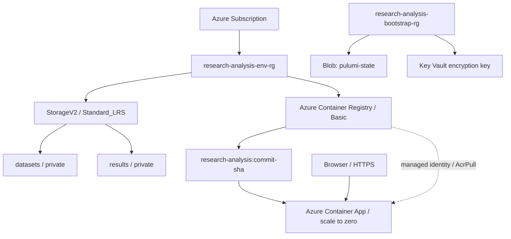

# Research Analysis Platform

A production-shaped learning project for turning analysts' research calculations into
tested application artifacts and repeatable Azure infrastructure.

Implemented so far:

- Python securities-return analysis, CSV processing, FastAPI, tests, and Docker image
- Python Pulumi project using the Azure Native provider
- Azure Resource Group, StorageV2 account, and private `datasets`/`results` containers
- Azure Blob Storage backend for self-managed Pulumi state
- Azure Key Vault key for Pulumi configuration-secret encryption
- Azure Container Registry and a public, scale-to-zero Azure Container App
- Browser interface for submitting price series and viewing return analysis

AKS, private networking, application Key Vault integration, and production runtime
hardening are not implemented.

## Repository boundaries

- `app/`: application, research logic, API, tests, and Docker build
- `infra/`: Python Pulumi project and reusable Azure components
- `deploy/`: deferred Helm and Kubernetes runtime configuration
- `.github/workflows/`: GitHub Actions CI/CD automation

The pure `app/src/analysis` package has no Azure, HTTP, storage, Kubernetes, or Pulumi
dependency.

## Application development

```bash
cd app
python3.12 -m venv .venv
source .venv/bin/activate
python -m pip install -r requirements-dev.txt
ruff format --check .
ruff check .
mypy
pytest
uvicorn src.api.main:app --reload
```

The application exposes the browser interface at `/`, `GET /health`, and
`POST /analysis`.

## Infrastructure architecture



Pulumi provisions Azure infrastructure. GitHub Actions builds and publishes the
application artifact, then updates the Container App to the immutable commit tag. The
public endpoint uses HTTPS-only ingress; the runtime pulls private images from ACR with
a managed identity.

## Pulumi backend and secrets

The canonical project is `infra/` and uses Python with `pulumi-azure-native`. DEV state
is self-managed in the private `pulumi-state` container in Storage Account
`rapstate18c845ca`. The backend authenticates with the current Azure CLI identity; shared
storage keys are disabled. The project pins its backend URL in `infra/Pulumi.yaml`.

Pulumi secret configuration is envelope-encrypted using the RSA key
`pulumi-state-secrets` in Key Vault `rap-kv-18c845ca`. The vault contains the encryption
key; it does not contain Pulumi state. Application secrets will use a separately managed
application boundary in a later phase.

Self-managed state must be protected, backed up, access-controlled, and never manually
edited. The bootstrap Resource Group must outlive every stack whose state it stores.

```bash
cd infra
python3.12 -m venv .venv
source .venv/bin/activate
python -m pip install -r requirements.txt
az login
pulumi login 'azblob://pulumi-state?storage_account=rapstate18c845ca'
pulumi stack select dev
pulumi config
pulumi preview
```

`preview` shows proposed changes, `up` applies an approved plan, `refresh` reconciles
state with provider reality, and `destroy` deletes managed resources. Do not destroy the
bootstrap resources while this backend is in use.

Prepared environments are `dev`, `staging`, and `prod`; only DEV has state and deployed
resources. Configuration lives in `Pulumi.<stack>.yaml`, never in source-code constants
or credential files.

## Phase 3 ACR and image deployment

### CI/CD application deployment

After an application pull request is merged, update your local `main` and explicitly
start the DEV deployment:

```bash
git switch main
git pull --ff-only origin main
deploy dev
```

The command requires a clean local `main` synchronized with `origin/main`. It does not
create commits or push code. It triggers `.github/workflows/application-deploy.yml` for
the merged commit and waits for GitHub Actions to finish. If that exact commit already
has a successful deployment, the command exits successfully without deploying it
again. Each successful workflow publishes both an immutable eight-character commit
tag and the movable `dev` tag. GitHub authenticates to Azure using OIDC; no Azure
client secret or ACR password is stored. A merge or push to `main` does not deploy
automatically.

The repository-level GitHub variables required by the workflow are
`AZURE_CLIENT_ID`, `AZURE_TENANT_ID`, and `AZURE_SUBSCRIPTION_ID`.

The DEV application URL is exported by Pulumi:

```bash
cd infra
pulumi stack output applicationUrl
```

### Deployment history and rollback

Inspect the running image, recent immutable ACR images, and successful deployments:

```bash
deploy history dev
```

Roll back to the previous immutable image, or select an explicit commit:

```bash
deploy rollback dev
deploy rollback dev 175dda35
```

Rollback never rebuilds or retags an image. It validates the target in ACR, updates
the Container App, waits for a healthy provisioned revision, and exercises both
`/health` and `/analysis`. If verification fails, the command automatically restores
and verifies the image that was running when rollback began.

### Manual application and infrastructure deployment

No image build or push is performed by Pulumi. The DEV deployment script previews and
applies the infrastructure, builds the application once with the current commit SHA,
pushes a Linux AMD64 image to ACR, and verifies the resulting tag and manifest:

```bash
./scripts/deploy-dev.sh
```

The script requires authenticated Azure CLI and Pulumi access, a running Docker daemon,
and a clean Git working tree. It does not use registry admin
credentials and does not publish `latest`.

For a manual deployment, run:

```bash
IMAGE_TAG=$(git rev-parse --short HEAD)

docker build \
  -t research-analysis:${IMAGE_TAG} \
  ./app

docker images research-analysis
az acr login --name ${REGISTRY_NAME}

docker tag \
  research-analysis:${IMAGE_TAG} \
  ${REGISTRY_SERVER}/research-analysis:${IMAGE_TAG}

docker push \
  ${REGISTRY_SERVER}/research-analysis:${IMAGE_TAG}
```

Tagging gives the existing local artifact its registry-qualified name without rebuilding
it. Build once, then promote that same artifact through environments.

Verify after a manual push without retrieving registry credentials:

```bash
az acr repository list \
  --name ${REGISTRY_NAME} \
  --output table

az acr repository show-tags \
  --name ${REGISTRY_NAME} \
  --repository research-analysis \
  --detail \
  --output table

az acr manifest list-metadata \
  --registry ${REGISTRY_NAME} \
  --name research-analysis \
  --output table
```

A tag such as `research-analysis:a8c21fd` is a readable pointer. A digest such as
`sha256:...` identifies the exact image content. Commit tags provide traceability,
rollback, reproducibility, and auditability; deployments should retain a path to the
immutable digest even when additional human-friendly tags such as `dev`, `staging`, or
`release-1.2.0` are added later.

## Current security and cost choices

- ACR uses the cost-conscious Basic SKU.
- ACR admin credentials and anonymous pulls are disabled.
- The Container App uses a managed identity with scoped `AcrPull` access.
- DEV uses HTTPS-only public ingress and scales down to zero replicas when idle.
- Authentication uses Azure CLI/Entra ID; no registry password is retrieved or exported.
- Storage requires HTTPS and TLS 1.2 and disallows anonymous Blob access.
- No access keys, client secrets, Pulumi tokens, or Docker credentials are committed.
- ACR geo-replication, Premium features, private endpoints, and Defender integrations are
  intentionally deferred.

## Deferred work

- VNet, subnets, CIDR planning, NSGs, and private endpoints
- Workload Identity and broader application RBAC
- AKS and PostgreSQL
- application Key Vault integration
- Azure Monitor, Log Analytics, and Application Insights
- Helm/Kubernetes deployment
